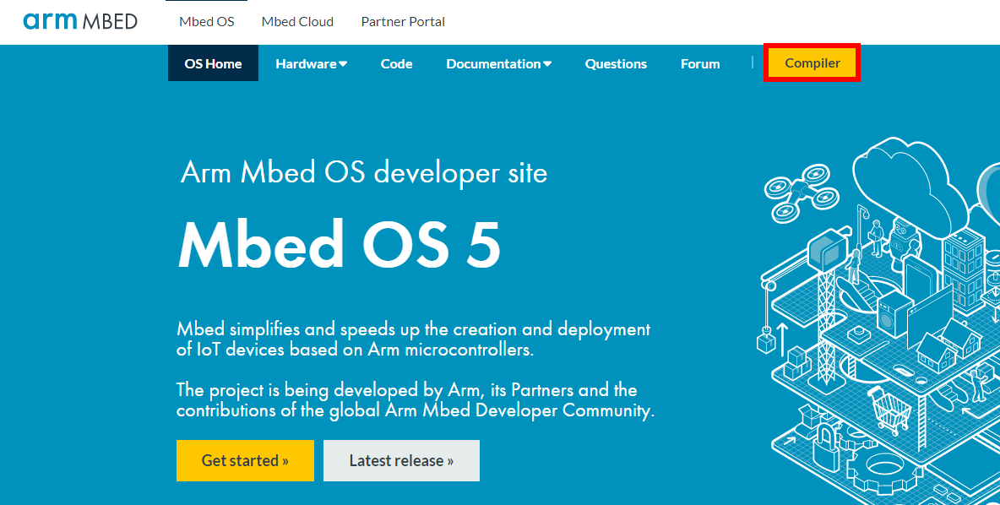
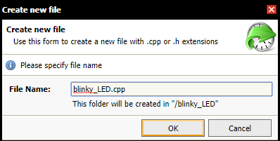

###Windows
---
**使用Mbed编译代码并且上传至BM4模块**

1. 进入[Mbed在线编译器](https://os.mbed.com/)官网，点击`compiler`(红框高亮），进入在线编译器注册页面（图1）。<p align="center"></p> <p align="center">图1</p>
2. 点击`Signup`完成注册信息成为在线编译器用户,系统自动跳转至在线编辑器界面。如没有自动跳转，请点击第一步中的链接进入在线编译器（图2）。<p align="center"></p><p align="center">图2</p>
3. 进入在线编译器，添加目标平台。点击界面右上角的`No device selected`（图3），<p align="center"></p><p align="center">图3</p>
弹出窗口中选择`Add Platform`(图4），<p align="center"></p><p align="center">图4</p>
在平台列表中选择`NUCLEO-F446RE`（图5），<p align="center"></p><p align="center">图5</p>
选择屏幕右侧的`Add to your Mbed Compiler`（图6）。<p align="center"></p><p align="center">图6</p>
4. 回到在线编译器，确定`NUCLEO-F446RE`已选择（图7)，<p align="center"></p><p align="center">图7</p>点击左上角`New`建立一个空白项目（图8)，<p align="center"></p><p align="center">图8</p>依次选择弹出对话框中的选项如图9所示。<p align="center"></p><p align="center">图9</p>
5. 导入library。右键选择项目名称`blinky_LED -> Import Library -> From Import Wizard`（图10），<p align="center"></p><p align="center">图10</p>在搜索栏中输入`mbed`，选择`mbed`，然后`Import!`(图11，12）。<p align="center"></p><p align="center">图11</p><p align="center"></p><p align="center">图12</p>
6. 新建一个`.cpp`文件。右键选择`blinky_LED -> New file`，输入文件名`blinky_LED.cpp`确定（图13）。<p align="center"></p><p align="center">图13</p>
7. 输入如下所示代码，使LED灯产生亮灭效果。然后点击`Compile`生成`blinky_LED_NUCLEO_F446RE.bin`文件（图14）。<p align="center"></p><p align="center">图14</p>

```c
#include "mbed.h"

DigitalOut myled(PC_15);//LED is attached to pin 'PC_15'

int main() {
    while(1) {
        myled = 1; // LED is ON
        wait(1.0); // 1 sec
        myled = 0; // LED is OFF
        wait(1.0); // 1 sec
    }
}
```
**使用ST-link下载.bin文件至BM4**

如下图所示把ST-link对应管脚与BM4连接起来。用一根Micro USB type ab数据线给BM4供电，红色电源指示灯变亮。使用另外一根Micro USB数据线连接PC和ST-link。此时电脑中会显示BM4为存储盘。把步骤7中生成的`blinky_LED_NUCLEO_F446RE.bin`文件直接拖拽到此存储盘中，下载完成。此时BM4的绿色LED指示灯闪烁。


<p align="center"></p>


